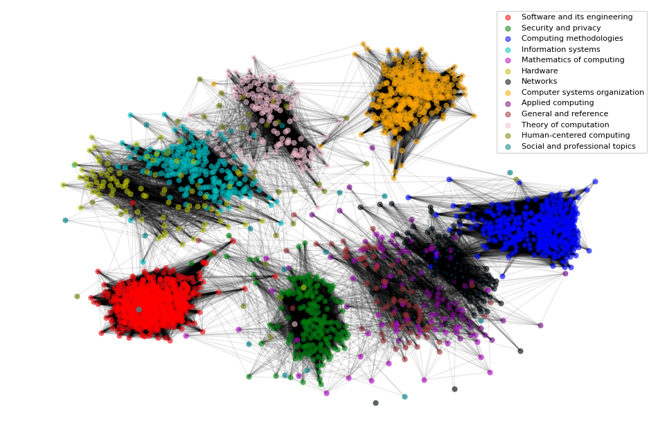
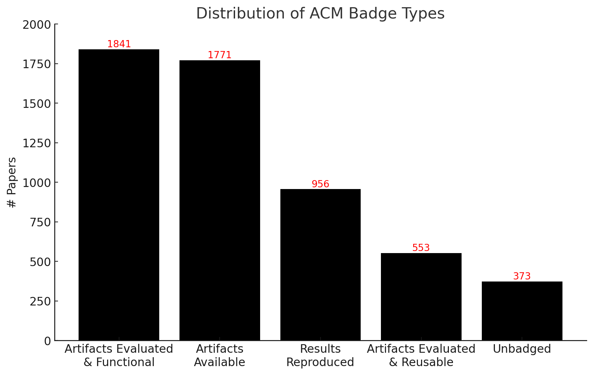
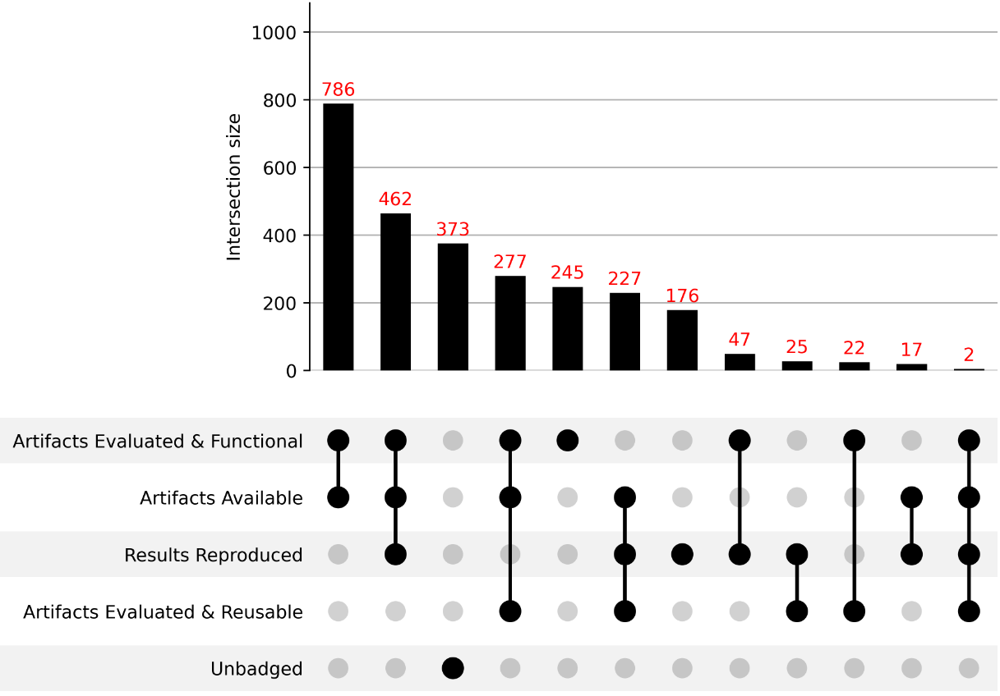

# scholarlyreprograph
Exploiting Graph Structures for Reproducibility Badge Prediction in Academic Papers

## About



The number of publications is growing at an accelerated pace, leaving researchers with insufficient time to assess every paper that is published. However, by harnessing the power of machine learning and transfer learning, we can develop models that can predict the likelihood of reproducibility badges for these papers. The primary objective of the project is to construct graphs connecting different scholarly papers from the ACM digital library dataset and build predictive models using graph neural networks to constrast them with tabular machine learning models in estimating the likelihood of research papers receiving reproducibility badges.

## Badges Distribution

--------------------------------------


## Repository structure

```shell
TBA
```

## Data Collection
In an effort to build a consolidated repository of datasets pertaining to reproducibility of scholarly articles, we initiated [reproducibility/datasets](https://github.com/reproducibilityproject/datasets/). The central idea here was to work towards studying "All things Reproducibility in Science". Data collection for this repository is included within the [ACMBadges](https://github.com/reproducibilityproject/datasets/tree/main/data/ACM) sub-directory, which is one of the data sources part of the comprehensive data collection efforts. Specifically, the fourth phase included the largest collection of Badged and Unbadged articles from ACM Digital Library.


## Authors/Contributors
[Akhil Pandey](https://github.com/akhilpandey95), [Harish Varma](https://github.com/harishsiravuri)

## PI, and Co-PI
[Hamed Alhoori](https://github.com/alhoori), [David Koop](https://github.com/dakoop)

## Acknowledgement
This work is supported in part by NSF Grant No. [2022443](https://www.nsf.gov/awardsearch/showAward?AWD_ID=2022443&HistoricalAwards=false).


## Citation
If you find this work useful, please cite our paper:

```
TBA
```